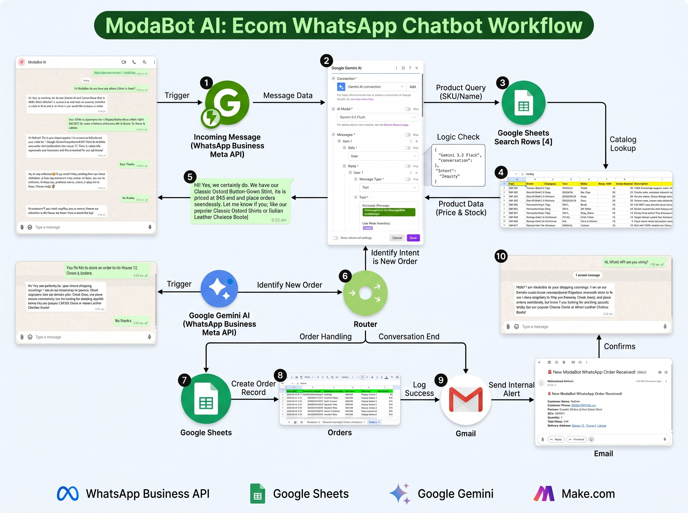

# ModaBot AI: Autonomous WhatsApp E-Commerce Sales Concierge

An end-to-end conversational AI commerce agent built for high-volume retail to handle natural language customer inquiries, real-time inventory verification, and automated order processing on WhatsApp.



## Overview

High-volume online merchants frequently lose conversions due to off-hour response delays, manual catalog querying, and human error during checkout data entry. **ModaBot AI** eliminates these operational bottlenecks by providing an autonomous, 24/7 conversational sales funnel via WhatsApp.

The system interprets free-form buyer intent using Google Gemini, validates product availability against a live Google Sheets database, extracts order entities into structured JSON, and coordinates fulfillment across email and customer messaging channels.

---

## Architecture & Workflow

```text
Customer (WhatsApp) ──> Webhook Listener (Green API / Meta API)
                                    │
                                    ▼
                         Google Sheets: Search Rows
                                    │
                                    ▼
                         Tools: Text Aggregator (Catalog Context)
                                    │
                                    ▼
                         Google Gemini AI (LLM Intent Reasoning)
                                    │
                                    ▼
                             JSON Parse Module
                                    │
                                    ▼
                                  Router
                     ┌──────────────┴──────────────┐
                     ▼                             ▼
              [Filter: INQUIRY]             [Filter: ORDER]
                     │                             │
                     ▼                             ▼
       Send WhatsApp Reply           Google Sheets: Add Row (Order Log)
                                                   │
                                                   ▼
                                          Gmail API: Dispatch Alert
                                                   │
                                                   ▼
                                          Send WhatsApp Confirmation
```

### 1. Ingestion & Catalog Grounding

- **Webhook Trigger:** Captures incoming messages with payload metadata (sender phone, timestamp, message body).
- **Inventory Search:** Queries active catalog rows from Google Sheets based on the inquiry.
- **Context Assembly:** Uses a text aggregator to inject clean SKU, pricing, size, and stock parameters into the prompt.

### 2. Cognitive Routing (Gemini AI)

- **Model:** Google Gemini configured with zero-shot guardrails, strict catalog grounding, and output schema constraints.
- **Deterministic Classification:** Categorizes the interaction as either `INQUIRY` (general questions, sizing, stock) or `ORDER` (intent to purchase with customer details).

### 3. Execution & Tri-Channel Dispatch

- **Inquiry Path:** Routes customer questions directly back to WhatsApp with dynamic stock information in sub-2-second latency.
- **Order Path:** Concurrently logs transactions to the master database, dispatches an HTML fulfillment alert to operations via Gmail, and fires a structured confirmation receipt to the buyer.

---

## Structured Output Schema

The conversational engine enforces strict JSON formatting to guarantee downstream routing and error-free database writes:

```json
{
  "intent": "ORDER",
  "reply": "Thank you, Mohsin! Your order for 1x Classic Oxford Button-Down Shirt (SKU: MB-001) has been confirmed. Total: $45. Dispatching to House 12, Street 4, Lahore.",
  "order_data": {
    "customer_name": "Mohsin",
    "sku": "MB-001",
    "product_name": "Classic Oxford Button-Down Shirt",
    "quantity": 1,
    "delivery_address": "House 12, Street 4, Lahore",
    "total_price": 45
  }
}
```

---

## Key Features

- **Sub-2-Second Turnaround:** Delivers instant, real-time responses to eliminate customer abandonment.
- **Strict Catalog Grounding:** Prevents hallucination of nonexistent SKUs, out-of-stock items, or erroneous pricing.
- **Automated Data Normalization:** Standardizes phone numbers, street addresses, and item counts directly into tabular formats.
- **Prompt Injection Defense:** Deflects technical prompt inquiries and maintains strict e-commerce concierge persona.

---

## Tech Stack

| Layer | Technology |
|---|---|
| Platform Integration | WhatsApp Business API / Green API |
| Orchestration Engine | Make.com |
| LLM Reasoning | Google Gemini API |
| Database & Inventory | Google Sheets API |
| Alerts & Messaging | Gmail API |
